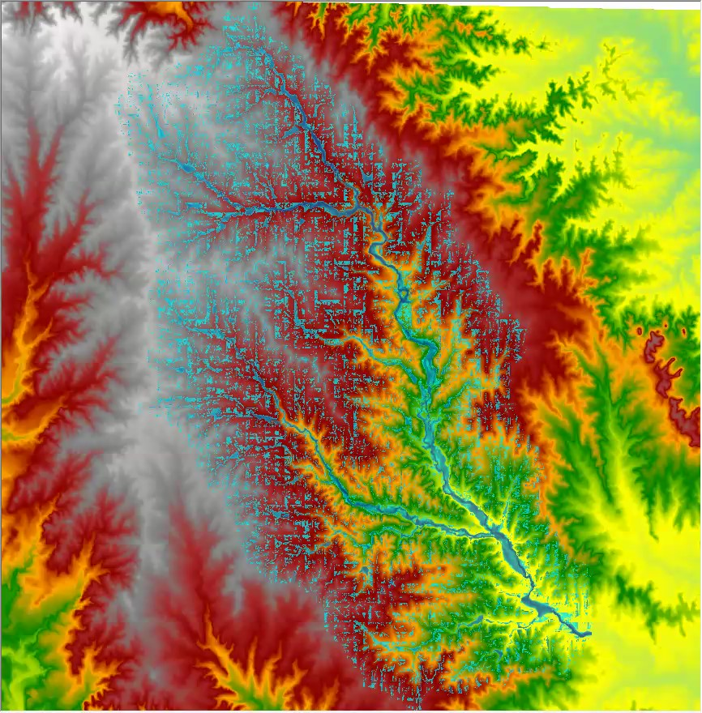
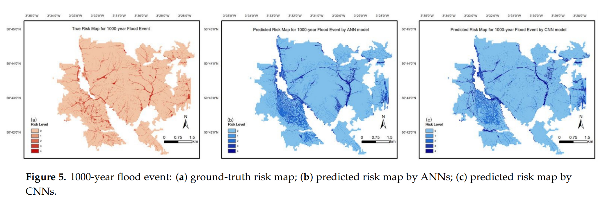
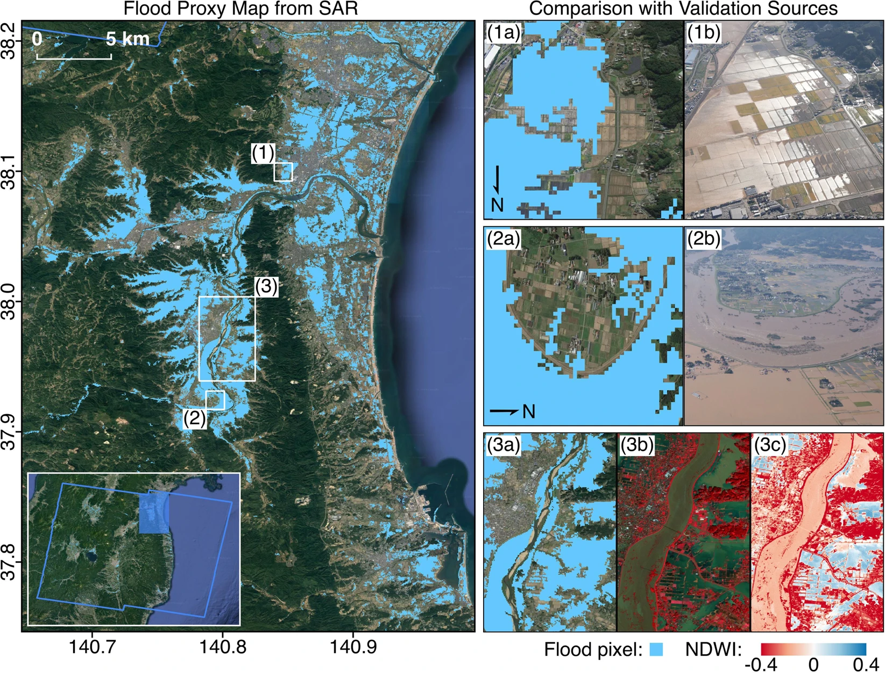
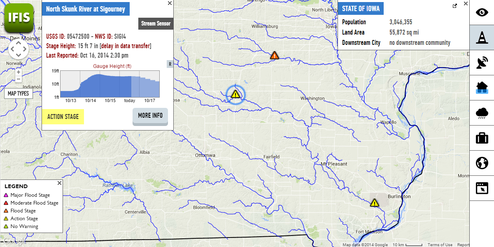
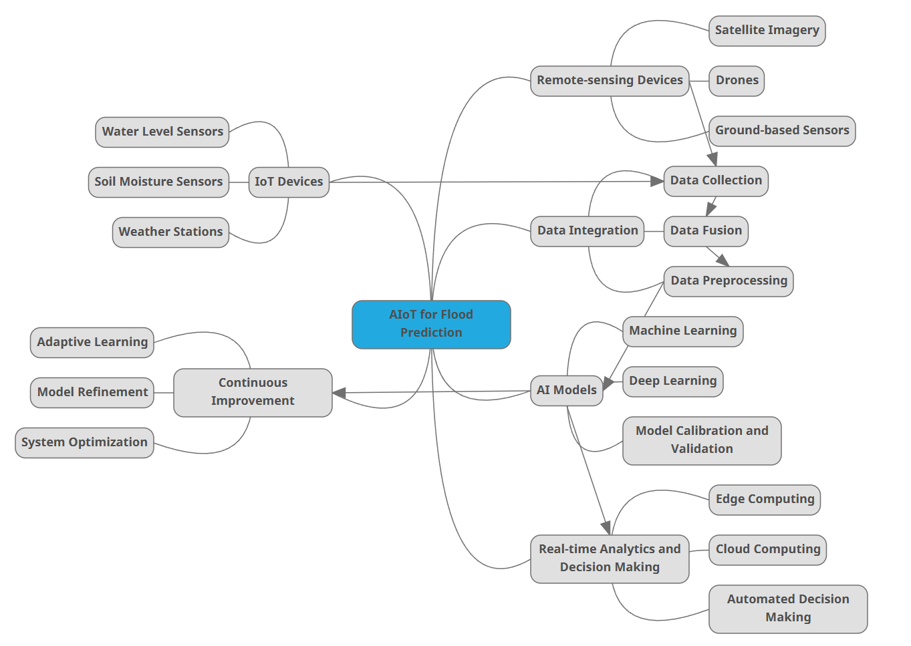

class: inverse, center, middle
```{r xaringan-themer, include=FALSE, warning=FALSE}
library(xaringanthemer)
style_mono_light(
  base_color = "#23395b",  
  #header_font_google = google_font("Josefin Sans"),
  #text_font_google   = google_font("Montserrat", "300", "300i"),
  #code_font_google   = google_font("Fira Mono")
  title_slide_background_image = "img/pic2.jpeg"
)
```

---
class: inverse, center, middle
# Approach Methodology & Output
---

--- 
## Workflow and Methodology
- To make policies implementable

  - Need to propose real analysis workflow
  
  - Give prototypes illustrating how EO data and remote sensing can help
  
  - Fit the workflow into the flood solution
  
  - Work on the chaining of function modules and potential automisation of pipeline
  
- How can these facilitate minimising risks for people, governments and more

  - How are information gaps closed
  
  - How are losses prevented
  
  - Identify persisting risks
  
---

## Flood Forecasting - A Quick Review
### The old-fashioned way - Hydrological model 
Uses historical data on precipitation, runoff, and other factors to predict flood occurrences. 
Relies on physical equations and mathematical representations of the water cycle, e.g.:
- Continuity Equation Balances water storage (∆S) with inflow (I) and outflow (O): 
  \begin{equation}
    \Delta S = I - O
    \end{equation}
- Runoff Estimation: 
$$Q = (P - Ia)^2 / (P - Ia + S)$$
  Where
  - Q: direct runoff (depth)
  - P: direct runoff (depth) 
  - Ia: initial abstraction, representing the water intercepted by vegetation, infiltration, and surface storage
  - S: potential maximum retention (depth), depending on soil type, land use, antecedent moisture conditions
  
<div class="footnotes">
<small>
- Reference: US Army Corps of Engineers, Hydrologic Engineering Center. (n.d.). <a href="https://www.hec.usace.army.mil/software/hec-ras/" target="_blank">HEC-RAS</a>. 
</small>
</div>

---
### The old-fashioned way - Hydrological model 

Example of simulating watershed on a map of Digital Elevation Model (DEM)
- Continuity Equation 
  - Ensures the water balance
  - Tracks the flow of water (through e.g. surface water, soil moisture and groundwater)
- Runoff Estimation: 
  - quantifying the amount of water 

```{r  include=FALSE}
video_path  <- "vids/400SqMileWatershed.mpeg"
video_files <- list.files(video_path,
                         pattern = "\\.mp4$",
                         recursive = TRUE,
                         all.files = FALSE,
                         full.names = TRUE)
```
<video width="1440" height="300" autoplay>
<source src="vids/400SqMileWatershed.mpeg" type="video/mp4">
</video>


<div class="footnotes">
<small>
- Reference: US Army Corps of Engineers, Hydrologic Engineering Center. (n.d.). <a href="https://www.hec.usace.army.mil/software/hec-ras/" target="_blank">HEC-RAS</a>. 
</small>
</div>
---
### The old-fashioned way - Hydrological model 
DEM-based hydrological models 
- Identify low-lying areas and floodplains in the urban landscape that are more susceptible to flooding. 
- Inform decisions
  - Planners: Floodplain zoning and land-use planning ( flood-resistant land uses, such as parks and recreational areas, to flood-prone regions.)
  - Emergency response teams can prioritise levees and floodwalls construction in certain areas
  - Design evacuation plans to minimise casualties
```{r echo=FALSE, out.width='25%',fig.align='center',fig.cap='A frame slice of Watershed Simulation, Credit: US Army Corps of Engineers, Hydrologic Engineering Center. (n.d.). <a href="https://www.hec.usace.army.mil/software/hec-ras/" target="_blank">HEC-RAS</a>.  https://doi.org/10.3390/w13243520 '}

```

---
class: inverse, center, middle
# Calling for a pipeline

---

### Persisting risks - Inflexibility in both time and space

### If ——
 - We shift the area of interest
  
 - Or, Progress from, say, 2022 to 2023

--

We have to redo watershed simulation with new data.

--

But we want to minimise avoidable repetitive human work, e.g., manual simulation of watershed for each date and each sub-zone of Kuala lumpur.

--

### So how do we improve temporal and spatial transferability and build a data pipeline?

--

### And what about automation? 

 
---
### Machine-learning based prediction - A blackbox considering numerous factors

| Data Pipeline Step | Description |
| --- | --- |
| Data Acquirement | Object extraction of Multi-spetcral and Radar data for Kuala Lumpur -> Data fusion on object-based level -> Image classification to get elevation, slope, soil type, substrate, land cover, NDVI, land use, imperviousness, distance to river, and distance to road |
| Pre-processing | Standardize with EPSG:3168 coordinate system -> convert vector to raster maps -> clip to Kuala Lumpur boundarie ->  resample to 1m resolution -> convert raster images to numerical data with 10m grid size using Rasterio |
| Feature Selection | Perform multicollinearity diagnosis test to exclude similar features -> Use features with VIF less than 10 in ANN models |
| Data Balancing | Balance data with oversampling and undersampling due to imbalanced flood risk distribution. Adjust non-flood areas (98%, 95%, 90% for 30-, 100-, and 1000-year events) and level 4 risk areas (0.01% and 0.06% for 30- and 100-year events) |
| Model Selection & Assessment | Apply NB, perceptron, ANN, and CNN models for 30-, 100-, and 1000-year flood events. Evaluate performance using following metrics |
---
## Flood prediction
### Metrics
Accuracy, F-beta score, and receiver operating characteristic (ROC) curve, as well as the oversampling and undersampling techniques used to address the issue of data imbalance. 

---
## Flood prediction
### A comparison across models:

```{r echo=FALSE, out.width='100%',fig.align='center',fig.cap='Credit: Li Z, Liu H, Luo C, Fu G. Assessing Surface Water Flood Risks in Urban Areas Using Machine Learning. Water. 2021; 13(24):3520. https://doi.org/10.3390/w13243520 '}

```

---
class: inverse, middle
# How Can Flood Prediction Help Kuala Lumpur: 


- ### How are information gaps closed

- ### How are loss prevented

- ### Identify persisting risks

  
---
## Flood Risk Management - Flood Prediction
Significant Savings in Case Studies
- European Union's Floods Directive: €460 million saved in avoided damages (2006-2015)

- Iowa Flood Center: $96 million saved in flood damage costs (2010-2015)

- Flood Forecasting Centre (UK): £1.2 billion saved in potential damages (2009-2014)

<div class="footnotes">
<small>
References: - European Environment Agency (2016). Flood risks and environmental vulnerability ↩

- Demir, I., & Krajewski, W. F. (2016). Towards an information system for the socially vulnerable groups during flood disasters ↩

- <a href="https://uiowa.edu/" target="_blank"->Environment Agency and Met Office (2015). Flood Forecasting Centre Five Year Review 2009-2014</a>. 
</small>
</div>

---

## Are information gaps "closed"? - Managing probability

 ### What if ——
 Due to a spatial mismatch between data scope and decision-making scope, we overlooked a location with a 99% chance of flooding and sent our response team to a place with only a 65% (what we consider to be the highest) likelihood of flooding.
 
--
 
In this scenario, the emergency response strategy fails. Therefore, keeping comprehensive data input and strategy output is essential.
 
--

### The trikiness of dealing with probability

--

  - Should we allocate resources proportional to the probability of flood ocurrence?

--
  
  - Or, should we design a response priority hierarchy considering both likelihood and potential harm?
  
--

  - Decide with a function design? Human-added weights? Machine-learned weights?


---
class: inverse, center, middle


# Does Prediction Suffice?
---
## Is prediction enough for flood risk management?
### Pros and cons of ML-based flood prediction
| Pros | Cons |
| --- | --- |
| Mature tech-flow | Computation-intense |
| Promising accuracy | Prone to Data Flaws |
| Utilising ML/DL models | Cumbersome to deployment|
| Prediction Based on Abundant information | Data-expensive |
| Almost always generate outcome | But Untimely! |
---
class: inverse, center, middle
# Introducing Real-time Monitoring
---
## Flood risk management - Real-time monitoring
### Synthetic Aperture Radar (SAR)
- SAR: Active remote sensing technology that can penetrate clouds, operate day or night, and provide high-resolution imagery1

- Real-time flood monitoring: Timely and accurate information on flood extent, duration, and impact for emergency response and management

### Benefits of SAR-based flood monitoring
- Rapid assessment: Quick acquisition and processing of data, enabling faster response to flood events

- Wide-area coverage: Large-scale flood monitoring, even in remote or inaccessible areas

- All-weather capability: Reliable data collection, regardless of weather conditions or time of day

<div class="footnotes">
<small>
References: - NASA Jet Propulsion Laboratory (2021). ARIA Project. https://aria.jpl.nasa.gov/
</small>
</div>

---

```{r echo=FALSE, out.width='70%',fig.align='center',fig.cap='FPM comparison with GSI aerial and Planet optical imagery for Fukushima. Credit: https://doi.org/10.1038/s41597-020-0443-5'}


# Comparison of FPM covering the Fukushima prefecture with aerial imagery from GSI and modified optical imagery from Planet. The blue polygon indicates the SAR footprint and white rectangles indicate the extents of zoomed-in panels on the right. The FPM (12 Oct, UTC 20:43) shows agreement with aerial imagery (13 Oct, UTC 04:30) where open water floods over low-lying crop fields (1a,1b) and river banks (2a,2b), and floods from double bounce next to low-rise buildings (2a, 2b) were appropriately detected. The water bodies detected were also similar to those inferred from optical imagery (13 Oct, UTC 01:22) based on dark blue and cyan areas in the FCC of reflectance (3b) and blue areas in the NDWI (3c).
```


---
## Risks of Real-time Monitoring 

 - ### How real-time is real time? 
  - Does a 5-seconds delay in data transmission fail an essential decision-making? 
  
--

 - ### How to quantify tolerance thresholds in regards of delay, error and bias?
  - A sharp cutoff or a fuzzy one?

--

 - ### What degree of accuracy? Managing response time of
  - Data acquirement, transmission and calculation
  - Human-based decision-making
  
  ### Incurs extra cost. The estimation is almost always NOT deterministic.

---
class: inverse, center, middle
# When AIoT Comes In

---
## AIoT comes to aid

- Introducing AIoT (Artificial Intelligence of Things) can lead to more efficient, accurate, and timely flood prediction systems.

| MLp-Pros | ML-Cons | AIoT Solution |
| --- | --- | --- |
| Mature tech-flow | Computation-intense | Edge computing for localized data processing |
| Promising accuracy | Prone to Data Flaws | Diverse IoT data sources improve model robustness |
| Utilizing ML/DL models | Cumbersome to deployment | Scalable and modular IoT deployment |
| Prediction Based on Abundant information | Data-expensive | Edge computing and data compression reduce data costs |
| Almost always generate outcome | Untimely | Real-time data enables timely predictions and responses |

---
## AIoT comes to aid
Connects remote-sensing devices to the IoT network, enabling seamless data flow between
 - Devices
 - Edge computing nodes
 - Cloud platforms
 
(Supprted by communication protocols such as MQTT, LoRaWAN, or Zigbee)

--

- To supplement EO data with real-time, hyperlocal data collected from IoT devices:
 - Water level sensors
 - Soil moisture sensors
 - Weather stations

- To help capture local variations and enhances overall model performance, perform data fusion, i.e., combine:
  - IoT-generated data
  - EO data 
  - SAR imagery and other remote sensing datasets

---
## AIoT comes to aid
### Automatical iteration of models:

With ground truth data continuously provided by IoT devices, models are evaluated and calibrated by:

 - Real-time ground truth data input from nature
 
 - Feedback from decision-making models and human 
  
Adaptive-learning models adjust and improve predictive capabilities over time, allowing for responding to

 - Changing environmental conditions 
 
 - Extreme weather events

---
```{r echo=FALSE, out.width='100%',fig.align='center',fig.cap='Real-time water levels and stage heights with flood alert levels, and flood forecast. Credit: https://ifis.iowafloodcenter.org/ifis/'}

```
---
class: inverse, center, middle
# What Else Is Possible?


---
##Outlook - Automated decision-making 
```{r echo=FALSE, out.width='68%',fig.align='center',fig.cap='AIoT Architecture for auto-decision-making'}

```

---
##Outlook - Automated decision-making based on Real-time analytics

- Edge devices take in real-world data -> 

- Edge computation nodes share computation tasks (pre-processing, training, validation, etc.) in parallel -> 

- Predictions generated by ever-updating models are compared through and integrated at decision centre / A ensemble model is given -> 

- Strategy coping with status quo is auto-generated  

--

Vulnerable in that the system is very hackable (Data input, analysis, strategy output are all handled by AI):

- What if the edge devices in a crucial area goes offline?

- How to make sure the ensemble always weight towards maximum survival of people?

--

We emphasise the disaster awareness of human being: **All final decisions require expert review and human approval**. So the solution network can be scalable, elastic to damage, and serves the public's well-being correctly.

---
## References

IOWA FLOOD INFORMATION SYSTEM. https://ifis.iowafloodcenter.org/ifis/

Li, Z. et al. (2021) ‘Assessing Surface Water Flood Risks in Urban Areas Using Machine Learning’, Water, 13(24), p. 3520. doi:10.3390/w13243520.


Malaysia - Vulnerability | Climate Change Knowledge Portal (no date). Available at: https://climateknowledgeportal.worldbank.org/country/malaysia/vulnerability (Accessed: 23 February 2023).

NASA Jet Propulsion Laboratory (2021). ARIA Project. https://aria.jpl.nasa.gov/

Tay, C.W.J., Yun, SH., Chin, S.T. et al. Rapid flood and damage mapping using synthetic aperture radar in response to Typhoon Hagibis, Japan. Sci Data 7, 100 (2020). https://doi.org/10.1038/s41597-020-0443-5'


